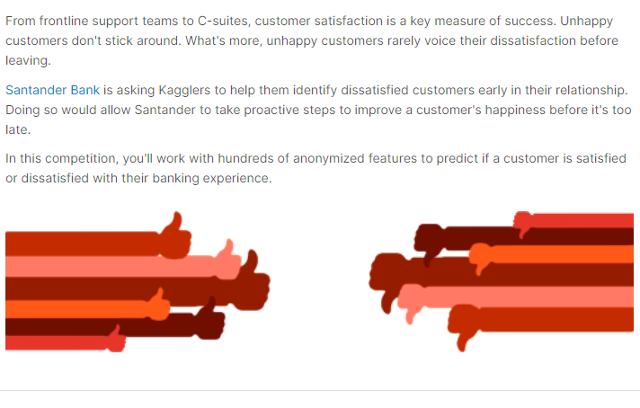
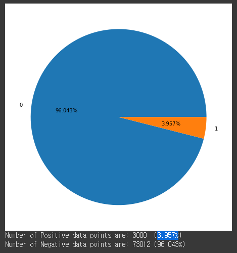
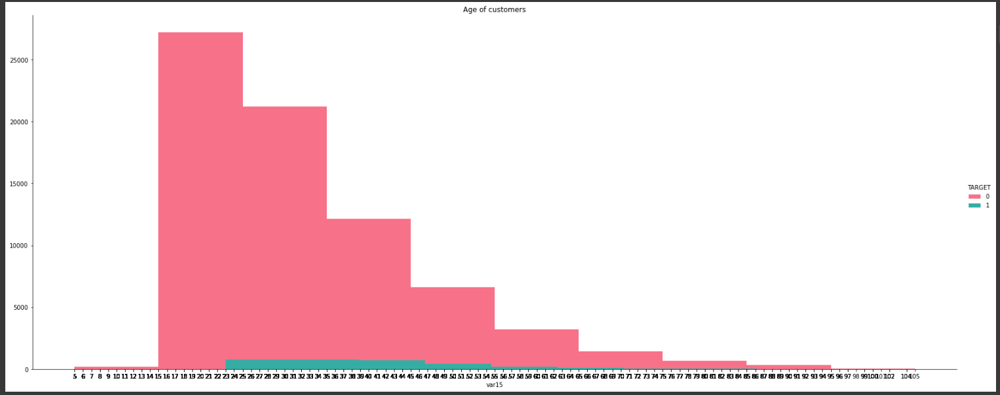
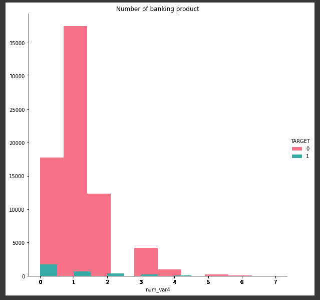

# Kaggle - [Santander Customer Satisfaction](https://www.kaggle.com/c/santander-customer-satisfaction)



# 프로젝트 인원
- 김성록, 김치성, 박종연, 최지훈

# 설명
- 은행의 데이터세트에서 만족 불만족을 평가하는 모델을 만드는 것

# 데이터 설명
```
kaggle competitions download -c santander-customer-satisfaction
```
- https://www.kaggle.com/competitions/santander-customer-satisfaction/data
- TRAIN.csv
    - 암호화가 된 데이터
    - 컬럼 370개 + TARGET 1개
        - TARGET 분포 비율
        - 
    
- TEST.csv
    - 암호화가 된 데이터
    - 컬럼 370개

# 사용 대표 모델
- XGBClassifier 를 사용


# 내용 설명
- 탐색적 데이터 분석 (EDA)
    - 특성 유추
        1. age로 판단 되는 column
        - 
        2. 계좌 보유로 판단 되는 column
        - 
    - 특성 중요도
        - 

- 컬럼 제거(train-ID,TARGET 제거, test-ID 제거)
    1. 성록 - Pipeline과 재귀기능을 사용
         - 369개 column중 187개 컬럼 삭제 총 182개
    2. 지훈 - 특성과 특징을 살려서 제거
         - 369개 column중 247개 컬럼 삭제 총 122개
- 필요 칼럼 추가
    - Preprocess
        - 전처리 기능
    - PCA
        - PCAOne, PCATwo column 추가
    - TSNE
        - SumZeros, tsne1, tsne2 column 추가
- 모델 훈련
    - XGBClassifier를 이용해 훈련
    - Kaggle에 제출을 위해서는 CalibratedClassifierCV를 사용
        - 케글에 제출 하기 위해서 사용
        - 결과값을 확률로 받을 수 있음
